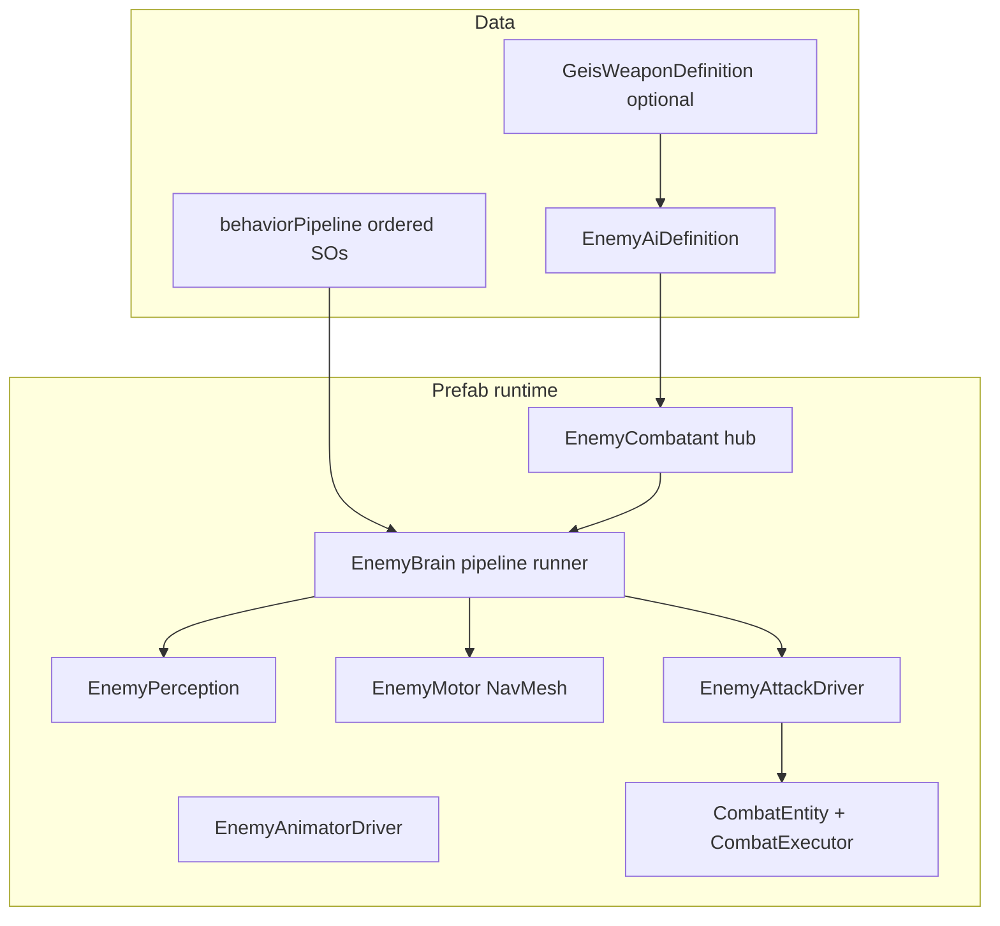

# Enemies (Geis)

**Status**: current  
**Last updated**: 2026-06-03

## Purpose

Real-time hostile AI for third-person combat: acquire the player, close distance with readable locomotion (walk/jog/run), telegraph melee attacks, and integrate with the shared RogueDeal damage pipeline.

## Scope

- **Owns**: `Assets/Geis/Scripts/Enemies/`, `EnemyAiDefinition`, behavior pipeline, encounter reset, enemy locomotion presentation.
- **Does not own**: Player weapons/combos ([combat.md](combat.md)), legacy card/RPG enemy data (`RogueDeal.Enemies.EnemyDefinition`), turn-based targeting outside the live `CombatEntity` bridge.

## Architecture

### Behavior pipeline (designer-facing)

`EnemyBrain` runs **one ordered list per tick**. The first `EnemyBehavior` asset that returns true from `TryExecute` owns the frame.

**Closing distance**: `GetMeleeClosingDistance()` aligns NavMesh goals with `EnemyAttackDriver` select range (no extra +0.3 m “strike horizon”). Approach runs until `HasAnyAttackInRange`; strafe only when already within closing distance (cooldown spacing).

**Default order** (used when `behaviorPipeline` is empty):

1. Dead  
2. Stagger  
3. Attack phase (telegraph / execute / recover)  
4. Acquire target  
5. Approach target (close; commits melee as soon as in range)  
6. Melee attack (fallback commit)  
7. Combat strafe (in range, on cooldown only)

Designers can:

- Reorder steps on `EnemyAiDefinition.behaviorPipeline`
- Disable a step via its `enabled` flag without removing it
- Omit the list entirely to use the built-in runtime pipeline

Menu: **Funder Games → Geis → Enemies → Create Default Behavior Pipeline Assets** and **Assign Default Pipeline To Selected Enemy AI Definition**.

New behavior types: subclass `EnemyBehavior`, add `[CreateAssetMenu]`, implement `TryExecute`, then add the asset to the pipeline.

### Locomotion: run then attack

- **NavMesh**: `EnemyMotor.ApplyApproachLocomotion` sets speed multiplier and gait from **horizontal distance to target** vs `movement.approachRunDistanceThreshold`.
- **Animator**: `EnemyAnimatorDriver` uses `LocomotionAnimatorApplier` (same as the player). `MoveSpeed` is **planar m/s**, not 0–1 normalized. `CurrentGait` is derived from speed via `GeisLocomotionGait` and `movement.animatorWalkSpeedReference` / `animatorRunSpeedReference` / `animatorSprintSpeedReference` (defaults match player tuning). `IsWalking` is true only for walk gait; run/sprint use `CurrentGait` ≥ 2 with `MovementInputHeld`.

Tune on `EnemyAiDefinition.movement`: `approachRunDistanceThreshold`, `approachRunSpeedMultiplier`, `approachFastGait` (Polygon: 2 = Run).

### Animation-driven telegraph (wind-up in the attack clip)

Use this when the swing clip already contains anticipation — same model as the player combo pipeline.

1. On `EnemyAttackDefinition`: **`telegraphDuration = 0`**, **`telegraphTrigger` empty**, keep **`attackTriggerOverride`** (e.g. `Attack`).
2. On `GeisWeaponDefinition.comboData`: assign the clip; set **`multiHitNormalizedTimes`** on the state to when damage should land (e.g. `0.535` = hit at 53% of the clip — everything before that is visual telegraph).
3. Optional: `GeisComboData` **startup / active / recovery** windows drive super armor via `EnemyAttackDriver` + `IAttackerPhaseProvider`.

The driver then fires **Attack immediately** (no extra code wait, no separate Telegraph trigger). `CombatExecutor.ExecuteActionWithScheduledEffectTimes` applies damage at the authored normalized times. Use **`telegraphDuration > 0`** only for a separate wind-up trigger or pause before Attack (VFX-only telegraph, non-combo rigs).

## Behavior & contracts

### `EnemyAiDefinition`

- Stats: `maxHealth`, `attack`, `defense`, optional `GeisWeaponDefinition` (preferred) or `equippedWeapon`.
- `attacks[]`: range, telegraph/recovery, cooldown, weight, triggers; combo resolution from weapon `GeisComboData` when present.
- `perception`: aggro/lose range, LOS; targets **player-like** `CombatEntity` only.
- `behaviorPipeline`: ordered `EnemyBehavior` assets (optional).

### `EnemyCombatant`

- Applies definition on start/reset; tags root `Enemy` layer/tag for player melee probes.
- Optional `legacyEnemyDefinition` for defeat events.

### `EnemyAttackDriver`

- Forces chosen player target on `CombatExecutor` (no retarget onto other enemies).
- Implements `IAttackerPhaseProvider` for interrupt/super-armor parity with player combos.

### `EnemyEncounterController`

- Resets managed `EnemyCombatant` instances; optional auto-loop after all defeated.

## Key types & assets

| Piece | Path |
|-------|------|
| Hub | `EnemyCombatant.cs` |
| Pipeline | `EnemyBrain.cs`, `Behaviors/*.cs` |
| Data | `Assets/Geis/Data/EnemyAIPhase1/` |
| Test prefab | `Assets/Prefabs/Enemies/P_Enemy_Phase1Humanoid.prefab` |
| Test scene | `Assets/Geis/Scenes/EnemyAITestArena.unity` |
| Legacy RPG | `RogueDeal/Enemies/EnemyDefinition.cs` |

## Integration

- Combat: [combat.md](combat.md) — damage, hit reactions, forced targeting.
- Locomotion presentation: Polygon/Synty parameters via `EnemyAnimatorDriver` (aligned with player `LocomotionAnimatorApplier` rules).
- Naming: `P_Enemy_<Name>`, `M_Enemy_<Name>` per `PROJECT.md`.

## Rules

- New melee enemies should use `EnemyAiDefinition` + the behavior pipeline; do not fork `EnemyBrain` for one-off archetypes — add a `EnemyBehavior` asset instead.
- Player melee must continue to resolve `Enemy` tag/layer on the combat root.
- Enemy attacks must pass an explicit player `CombatEntity` into `CombatExecutor` (no generic nearest-enemy retarget at execute time).
- Changes to default pipeline order or run/attack tuning must update this doc.

## Guidelines

- Prefer `GeisWeaponDefinition` + `GeisComboData` over orphan `CombatAction` references for new attacks.
- Use **Assign Default Pipeline** once per new `EnemyAiDefinition`, then customize order/toggles.
- For bespoke archetypes (ranged, flee), add new `EnemyBehavior` types rather than expanding the monolithic brain.

## Related documentation

- [combat.md](combat.md)
- Feature template: `Assets/Docs/Features/_enemy_template.md`
- Deep setup: `Assets/Documentation/` (historical)

## Changelog

- **2026-06-03**: Approach commits melee in-range; shorter telegraph / `telegraphCapWhileMoving`; pipeline order Approach → Melee → Strafe (reduces stop-then-wait-then-swing).
- **2026-06-03**: Melee closing uses attack select range only; strafe gated until within `GetMeleeClosingDistance` (fixes stop-then-creep-then-attack).
- **2026-06-03**: Enemy locomotion uses player `LocomotionAnimatorApplier` with m/s `MoveSpeed` and shared gait thresholds (fixes walk/run blend mismatch).
- **2026-06-03**: Added behavior pipeline (`EnemyBehavior` ScriptableObjects), `enemies.md`, run-when-far locomotion fix, distance-based approach tuning.
